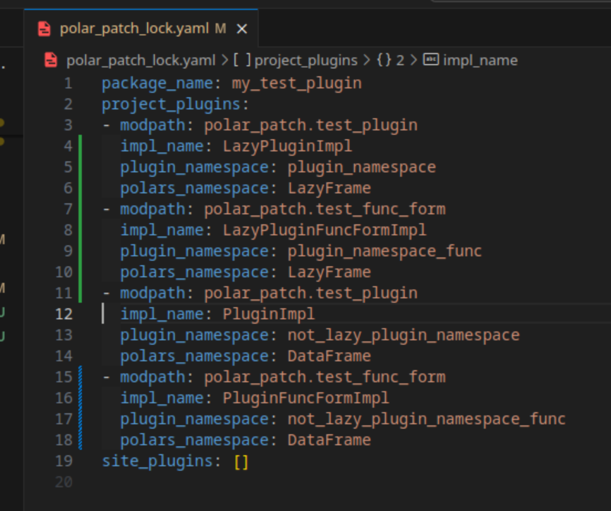
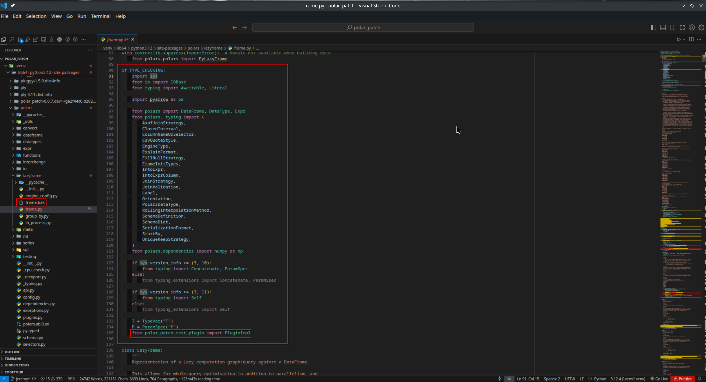
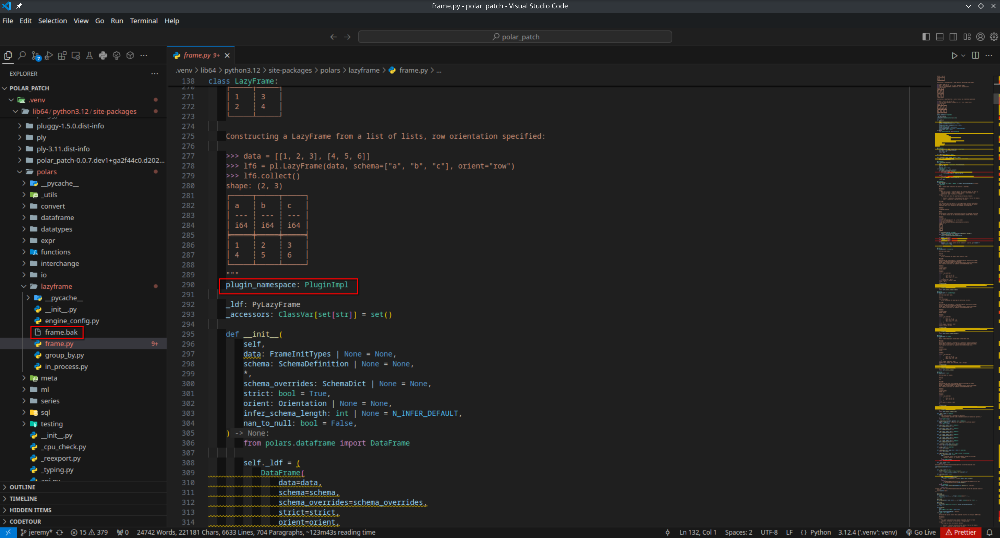

# EZPZ-Pluginz

A powerful tool that provides comprehensive type hinting and IDE support for Polars plugins, dramatically enhancing the development experience for custom Polars extensions.

## Installation

```bash
pip install ezpz_pluginz
```

## Problem It Solves

Polars is an incredibly fast DataFrame library for Python, but it lacks native support for type hints and IDE integration with custom plugins. The Polars maintainers have indicated they have no immediate plans to address this gap from within Polars itself. Summit Sailors steps in to bridge this crucial developer experience gap.

## Key Benefits

With EZPZ-Pluginz, developers can:

- **Enhanced Type Safety**: Write more robust and maintainable Polars plugins with full type checking support
- **Superior IDE Experience**: Leverage advanced IDE features including autocompletion, inline documentation, and error detection
- **Ecosystem Growth**: Contribute to the Polars ecosystem with greater confidence and tooling support
- **Hot Reloading**: Automatic type hint updates that point directly to your plugin implementations
- **Site-packages Integration**: Seamlessly load and manage plugins from installed packages
- **Registry Management**: Discover, install, and share plugins through a centralized registry system

## How It Works

EZPZ-Pluginz uses a sophisticated multi-step process to enhance your Polars development environment:

1. **Configuration Parsing**: Reads your `ezpz.toml` configuration file
2. **Code Scanning**: Intelligently scans specified files and directories for plugin definitions
3. **AST Analysis**: Uses [libCST](https://libcst.readthedocs.io/en/latest/) for precise code analysis and metadata extraction
4. **Lockfile Generation**: Creates a comprehensive lockfile containing all discovered plugin metadata
5. **Safe Backup**: Creates backup copies of Polars files before any modifications
6. **Type Enhancement**: Applies libCST transformers to inject type hints into appropriate Polars classes
7. **Import Management**: Adds necessary imports within `TYPE_CHECKING` blocks for optimal performance





## Plugin Definition Syntax

EZPZ-Pluginz supports multiple syntax patterns for maximum flexibility:

### Decorator Syntax

```python
from ezpz_pluginz.register_plugin_macro import ezpz_plugin_collect

@ezpz_plugin_collect(
    polars_ns="LazyFrame",
    attr_name="my_plugin",
    import_="from my_package.plugins import MyLazyFramePlugin",
    type_hint="MyLazyFramePlugin"
)
class MyLazyFramePlugin:
    def custom_operation(self):
        # Your plugin implementation
        pass
```

### Function Call Syntax

```python
from ezpz_pluginz.register_plugin_macro import ezpz_plugin_collect

class MyDataFramePlugin:
    def advanced_operation(self):
        # Your plugin implementation
        pass

# Register the plugin using function call syntax
ezpz_plugin_collect(
    polars_ns="DataFrame",
    attr_name="advanced_plugin",
    import_="from my_package.plugins import MyDataFramePlugin",
    type_hint="MyDataFramePlugin"
)(MyDataFramePlugin)
```

### Supported Polars Namespaces

- `DataFrame` - For DataFrame-specific plugins
- `LazyFrame` - For LazyFrame-specific plugins
- `Series` - For Series-specific plugins
- `Expr` - For Expression-specific plugins

## Configuration

Create an `ezpz.toml` file in your project root to specify plugin locations:

```toml
[ezpz_pluginz]
name = "my-polars-project"
include = [
    "src/plugins/",
    "plugins/dataframe_extensions.py",
    "external/custom_ops/"
]
site_customize = true  # Enable automatic plugin registration
```

Or using the config file (`pyproject.toml`):

```toml
[tool.ezpz_pluginz]
name = "my-polars-project"
include = [
    "src/plugins/",
    "plugins/dataframe_extensions.py",
    "external/custom_ops/"
]
site_customize = true
```

### Configuration Options

- `name`: Project identifier for your plugin collection
- `include`: List of files and directories to scan for plugins
- `site_customize`: Optional boolean to enable automatic plugin registration via sitecustomize.py

## CLI Usage

### Basic Plugin Management

#### Mount Plugins

Apply type hints and enable plugin support:

```bash
ezpz mount
```

Loads plugins specified in your ezpz.toml configuration, makes plugin functions available for use, and should be run after installing new plugins or changing configuration.

#### Unmount Plugins

Restore original Polars files and remove modifications:

```bash
ezpz unmount
```

Removes mounted plugins from your environment, useful for troubleshooting or cleaning up.

### Plugin Discovery and Installation

#### List Available Plugins

```bash
ezpz list
```

Shows all plugins with installation status (✓ = installed, ○ = not installed), displays plugin descriptions, authors, and versions, and sets up local registry if not present.

#### Advanced Plugin Search

```bash
ezpz find <keyword> [options]
```

Powerful search capabilities with flexible filtering options:

- `--field name|description|author|package|category|aliases|all` - Search in specific fields
- `--remote` - Search remote registry
- `--both` - Search both local and remote
- `--case-sensitive` - Case-sensitive search
- `--exact` - Exact match
- `--limit N` - Limit results
- `--details` - Show detailed info

Examples:

```bash
# Search for Rust-based plugins
ezpz find rust --field category

# Search for technical analysis plugins with details
ezpz find 'technical analysis' --remote --details

# Exact search for polars-related plugins
ezpz find polars --both --exact
```

### Registry Management

All registry management commands are under the `registry` subcommand:

#### Check Registry Health

```bash
ezpz registry health
```

Verifies connectivity and status of the central plugin registry server.

#### Register a New Plugin

```bash
ezpz registry register <plugin_path>
```

Register a new plugin to the remote registry. Requires `AUTH_SECRET` environment variable. Plugin must have a `register_plugin()` function. Path should point to your plugin directory or file.

#### Update an Existing Plugin

```bash
ezpz registry push <plugin_name> <plugin_path>
```

Update an existing plugin in the registry. Requires `AUTH_SECRET` environment variable. Updates the plugin version in the remote registry.

#### Refresh Registry

```bash
ezpz registry refresh
```

Downloads latest plugin information from registry, run this to see newly published plugins, and is automatically done when installing plugins.

#### Check Registry Status

```bash
ezpz registry status
```

Shows registry URL and local cache information, displays number of available and verified plugins, and is useful for troubleshooting registry issues.

#### Clear Registry Cache

```bash
ezpz registry delete
```

Removes the local registry cache (`~/.ezpz`), useful for troubleshooting registry corruption or clearing cache, and registry can be automatically recreated using refresh.

#### Delete a Plugin

```bash
ezpz registry delete-plugin <plugin_id>
```

Mark a plugin as deleted in the remote registry. Requires `AUTH_SECRET` environment variable. Removes the plugin from the local cache after successful remote deletion.

### Getting Help

```bash
ezpz --help
ezpz registry --help
```

Shows general help or help for registry commands.

## Plugin Registry System

EZPZ-Pluginz includes a comprehensive plugin registry system that enables:

- **Plugin Discovery**: Browse and search through available plugins from the community
- **Easy Installation**: One-command installation of plugins with automatic dependency management
- **Automatic Updates**: Stay up-to-date with the latest plugin releases
- **Health Monitoring**: Check registry connectivity and status
- **Plugin Management**: Register, update, and delete plugins with proper authentication

The registry system maintains a local cache for fast access and can synchronize with remote repositories to discover new plugins and updates.

## Important Notes

- **Minimally Invasive**: While this approach modifies the executing interpreter's Polars package, it uses libCST's concrete syntax trees to preserve file structure and formatting
- **Safe Backups**: Original files are always backed up before modification
- **Type Checking Only**: Imports are added within `TYPE_CHECKING` blocks to avoid runtime overhead
- **Reversible**: All changes can be completely undone using the unmount command
- **Authentication Required**: Registry operations that modify plugins require the `AUTH_SECRET` environment variable

## Development Status

### Beta Features ✅

- ~~Callable form of `pl.api`~~
- ~~Install plugins from site-packages~~
- ~~Basic logging system~~
- Enhanced function call syntax support
- Robust string value extraction
- Improved error handling and validation
- Plugin registry system with discovery and installation
- Registry health monitoring
- Plugin update and deletion capabilities

### Current Development Focus

- Comprehensive functional testing suite
- Advanced exception handling and recovery
- ~~Python version compatibility (unpinned from 3.12.4 to ^3.12)~~

### Stability Roadmap

- Extensive real-world testing and maturity
- Official blessing from the Polars team ([tracking issue](https://github.com/pola-rs/polars/issues/14475))
- Community feedback integration
- Performance optimization

## Advanced Features

- **Automatic Hot Reloading**: Type hints point directly to implementations for immediate updates
- **Site-packages Integration**: Automatically discovers and loads plugins from installed packages
- **Lockfile Management**: Maintains state consistency across development sessions
- **Multi-syntax Support**: Flexible plugin definition patterns for different coding styles
- **Robust Error Handling**: Graceful handling of malformed plugin definitions
- **Registry Integration**: Seamless plugin discovery, installation, and management through centralized registry
- **Advanced Search**: Powerful search capabilities with field-specific filtering and remote/local search options
- **Registry Health Monitoring**: Built-in health checks for registry connectivity
- **Authenticated Operations**: Secure plugin registration and management with authentication

## Contributing

We welcome contributions! Please see our contributing guidelines for details on how to submit improvements, bug reports, and feature requests.

## Support

For support and sponsorship opportunities, visit our Polar page:

<a href="https://polar.sh/summitsailors/subscriptions">
<picture>
<source media="(prefers-color-scheme: dark)" srcset="https://polar.sh/embed/tiers.svg?org=summitsailors&darkmode"/>

</picture>
</a>

## License

This project is licensed under the MIT License. See LICENSE file for details.
